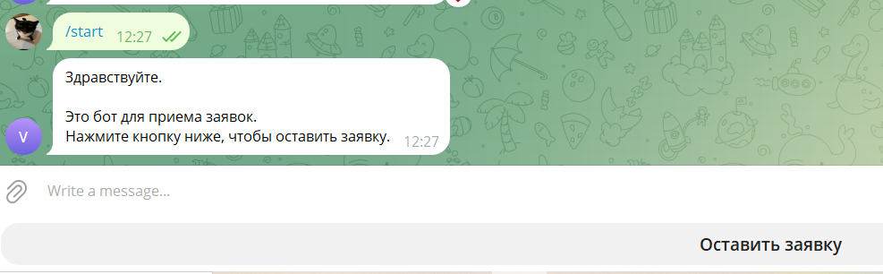
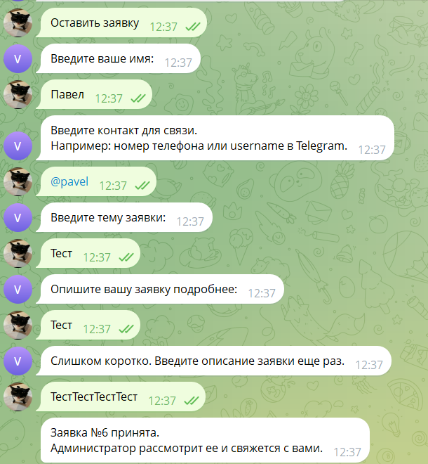
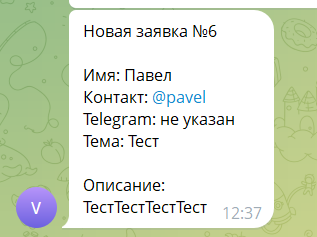
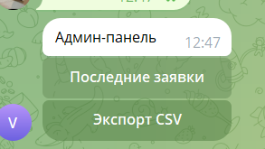
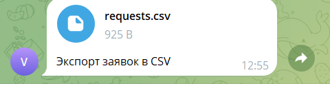

# tg-request-manager

Telegram-бот для приема и обработки заявок.

Проект представляет собой простой шаблон Telegram-бота, который позволяет пользователям оставлять заявки, а администратору — просматривать их, менять статус и выгружать данные в CSV.

## Возможности

* прием заявок от пользователей;
* пошаговая форма заявки;
* проверка пользовательского ввода;
* сохранение заявок в SQLite;
* уведомление администратора о новой заявке;
* админ-панель внутри Telegram;
* просмотр последних заявок;
* открытие карточки заявки;
* смена статуса заявки;
* экспорт заявок в CSV;
* хранение настроек в `.env`.

## Стек

* Python
* aiogram
* SQLite
* python-dotenv

## Структура проекта

```text
tg-request-manager/
├── app/
│   ├── __init__.py
│   ├── main.py
│   ├── config.py
│   ├── database.py
│   ├── states.py
│   ├── keyboards.py
│   └── handlers/
│       ├── __init__.py
│       ├── user.py
│       └── admin.py
├── scripts/
│   └── check_db.py
├── screenshots/
├── .env.example
├── .gitignore
├── requirements.txt
└── README.md
```

## Пользовательский сценарий

1. Пользователь запускает бота командой `/start`.
2. Бот показывает главное меню.
3. Пользователь нажимает кнопку «Оставить заявку».
4. Бот последовательно запрашивает:

   * имя;
   * контакт для связи;
   * тему заявки;
   * описание заявки.
5. Заявка сохраняется в базу данных.
6. Администратор получает уведомление о новой заявке.

## Админ-панель

Администратор может открыть панель командой:

```text
/admin
```

В админ-панели доступны:

* просмотр последних заявок;
* открытие конкретной заявки;
* смена статуса заявки;
* экспорт заявок в CSV.

Поддерживаемые статусы:

```text
new
in_work
closed
```

## Установка

Клонировать репозиторий:

```bash
git clone https://github.com/simushin/tg-request-manager.git
```

Перейти в папку проекта:

```bash
cd tg-request-manager
```

Создать виртуальное окружение:

```bash
python -m venv .venv
```

Активировать виртуальное окружение на Windows:

```bash
.venv\Scripts\activate
```

Установить зависимости:

```bash
pip install -r requirements.txt
```

## Настройка

Создать файл `.env` на основе `.env.example`:

```env
BOT_TOKEN=your_bot_token_here
ADMIN_ID=123456789
```

Описание переменных:

```text
BOT_TOKEN — токен Telegram-бота, полученный через BotFather.
ADMIN_ID — Telegram ID администратора.
```

Файл `.env` не должен попадать в GitHub.

## Запуск

Запустить бота:

```bash
python -m app.main
```

После запуска бот начнет принимать сообщения через Telegram.

## Проверка базы данных

Для просмотра сохраненных заявок можно использовать скрипт:

```bash
python scripts/check_db.py
```

Скрипт выводит список заявок из SQLite-базы в консоль.

## Экспорт заявок

Экспорт выполняется через админ-панель Telegram-бота.

Администратор нажимает кнопку «Экспорт CSV», после чего бот отправляет CSV-файл со списком заявок.

## Скриншоты

### Стартовое меню



### Форма заявки



### Уведомление администратора



### Админ-панель



### Экспорт CSV


```

## Что можно доработать

Возможные направления развития проекта:

* добавить веб-панель администратора;
* добавить роли пользователей;
* добавить поиск по заявкам;
* добавить фильтрацию по статусам;
* добавить выгрузку в Excel;
* добавить уведомления при смене статуса заявки;
* добавить хранение истории изменений заявки;
* добавить поддержку PostgreSQL.

## Статус проекта

Базовая версия проекта реализована.

Готово:

* форма заявки;
* сохранение в SQLite;
* уведомление администратора;
* админ-панель;
* смена статусов;
* CSV-экспорт;
* проверка пользовательского ввода.
